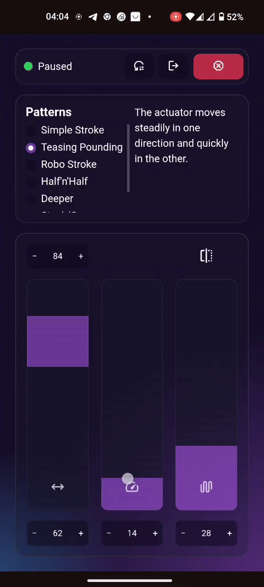
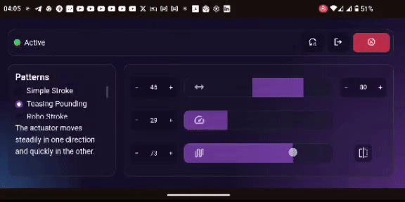

# OSSM Web Control
This is a web application that allows you to control your OSSM (Open Source Sex Machine) device over Bluetooth from your browser.  
It is accessible through your browser at [ossm-web.forestpuppy.pet](https://ossm-web.forestpuppy.pet/) or can be installed to your device as a Progressive Web App (PWA) for offline use! *(If your device supports it)*  

### Disclaimer:  
- As per the official OSSM notices, the Bluetooth API is still experimental and may be unsafe, **use this tool at your own risk**, I am not liable for any harm that may occur, you are using this site willingly.  
- There is currently a known issue where if multiple inputs are made in rapid succession, the app may enter an error state. Currently if this is detected the app will signal the OSSM to stop any movement and return to a stable state. A fix for this is being worked on.  

### Compatibility & Features:  
- [x] **Desktop:** Chrome, Edge, Opera, and other Chromium-based browsers
- [x] **Android:** Chrome
- [x] **iOS/iPadOS:** [Bluefy](https://apps.apple.com/us/app/bluefy-web-ble-browser/id1492822055)
- [x] Speed & stroke control
- [x] Pattern & intensity control
- [ ] State checking *(Safety features [1 bug], work in progress, high priority)*
- [ ] Session sharing over web

### Contributing:  
Contributions are welcome! If you find any issues or have suggestions for improvements, please open an [issue](https://github.com/ReadieFur/OSSM-Web-Control/issues) or submit a pull request on the [GitHub repository](https://github.com/ReadieFur/OSSM-Web-Control/). The more issues found & fixed, the safer the app will be for everyone!

### Demos:  

  
  

### References:  
| Resource | Used for |
| :------- | :------- |
| [OSSM GitHub Repository](https://github.com/KinkyMakers/OSSM-hardware) | OSSM device specifications and communication protocols. |
| [Ossm-BLE-Web](https://github.com/ReadieFur/OSSM-BLE-Web) | Library for Bluetooth communication with OSSM devices. |
| [Kevin Powell](https://codepen.io/kevinpowell/pen/XJJwaxG) | Inspiration for the CSS glass effect. |
| [Mozilla Web API Documentation](https://developer.mozilla.org/en-US/docs/Web/Progressive_web_apps/Guides/Offline_and_background_operation) | Reference for implementing PWA features. |
| [PitClamp-Mini](https://github.com/armpitMFG/PitClamp-Mini) | Model used in the logo design. |
| Source Code | Other smaller references are included in the source code comments. |
