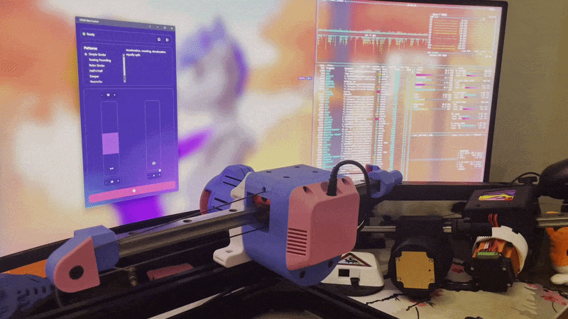
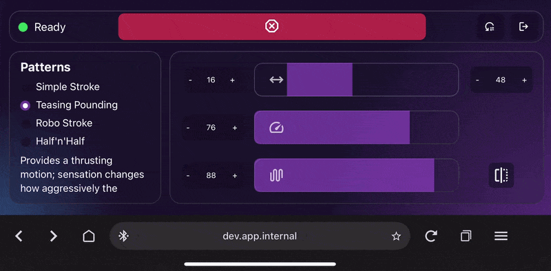

# OSSM Web Control
A web application that allows you to control your [OSSM (Open Source Sex Machine)](https://github.com/KinkyMakers/OSSM-hardware) device over Bluetooth from your browser on [all major devices](#compatibility--features).  
It is accessible at [ossm-web.forestpuppy.pet](https://ossm-web.forestpuppy.pet/) and can be installed to your device from there for offline use!  

> [!WARNING]
> As per official OSSM notices, **use BLE controls at your own risk**.  
> The author is not liable for any personal injury, hardware damage, or malfunction that may occur. You choose to use this application entirely of your own accord.

> [Overview](#ossm-web-control) • [Previews](#preview) • [Features](#compatibility--features) • [Contributing](#contributing) • [Developer Quickstart](#developer-quickstart)  

<hr>
<a id="preview"></a>
<table align="center">
    <tr>
        <td align="center" width="50%">
            <b>Speed & Range Control</b><br>
            
        </td>
        <td align="center" width="50%">
            <b>Portrait UI</b><br>
            
        </td>
    </tr>
    <tr>
        <td align="center" width="50%">
            <b>Pattern Support</b><br>
            
        </td>
        <td align="center" width="50%">
            <b>Landscape UI</b><br>
            
        </td>
    </tr>
</table>

## Compatibility & Features  
A quick overview on what this application supports and what is to come!  

> **Legend:** ✅ Working | ⚠️ Issue | ⬜ Planned

<!-- Using custom HTML here since GitHub's default markup styling isn't quite adequate for what I wanted to do here -->
<ul style="list-style-type: none; padding-left: 0;">
    <li><b>Supported platforms:</b> Any BLE capable browser!
        <ul style="list-style-type: none; padding-left: 1.5em;">
            <li>✅ <b>Desktop:</b> Any Chromium-based browser (Chrome, Edge, Brave)</li>
            <li>✅ <b>Android:</b> Google Chrome</li>
            <li>✅ <b>iPhone:</b> <a href="https://apps.apple.com/us/app/bluefy-web-ble-browser/id1492822055">Bluefy Browser</a></li>
        </ul>
    </li>
    <li style="margin-top: 0.5em;"><b>Control Features:</b>
        <ul style="list-style-type: none; padding-left: 1.5em;">
            <li>✅ Speed and range adjustments</li>
            <li>✅ Custom patterns & sensation</li>
            <li>⬜ Absolute positioning</li>
        </ul>
    </li>
    <li style="margin-top: 0.5em;"><b>Safety & Reliability:</b>
        <ul style="list-style-type: none; padding-left: 1.5em;">
            <li>✅ <b>Emergency stop:</b> Immediately halts all movement</li>
            <li>✅ <b>Recalibration:</b> Allows re-homing of the rail</li>
            <li>✅ Automatic state handling</li>
        </ul>
    </li>
    <li style="margin-top: 0.5em;"><b>Extras:</b>
        <ul style="list-style-type: none; padding-left: 1.5em;">
            <li>✅ <b>Offline mode:</b> Installable as an app (PWA) on supported devices</li>
            <li>⬜ Remote session sharing</li>
            <li>⬜ External app syncing <i>(e.g., VRChat integration)</i></li>
        </ul>
    </li>
</ul>

## Contributing

Contributions are welcomed and encouraged! If you run into any issues, have feedback, or want to suggest improvements, feel free to open an issue or submit a pull request on the [GitHub repository](https://github.com/ReadieFur/OSSM-Web-Control/).

> [!TIP]
> **Reporting Connection Issues:**  
> If you encounter bugs specifically related to Bluetooth/BLE connectivity, please report them on the [OSSM-BLE-Web repository](https://github.com/ReadieFur/OSSM-BLE-Web).

Finding and fixing bugs helps make the application safer and more reliable for everyone!

## Developer Quickstart  

> [!NOTE]
> **Architecture Overview:**  
> - **Architecture:** Single Page Application (SPA) with routing/state managed via `ViewManager`.
> - **Hardware Abstraction:** Devices implement the `OssmProvider` abstract class, which the UI interacts with to read/set state.
> - **BLE Core:** Low-level Bluetooth logic resides in the `OSSM-BLE-Web` submodule.

```sh
# Clone the repository along with all submodules
git clone --recurse-submodules https://github.com/ReadieFur/OSSM-Web-Control.git
cd OSSM-Web-Control

# Install dependencies and start local dev server
npm install
npm run dev -- --open
```
